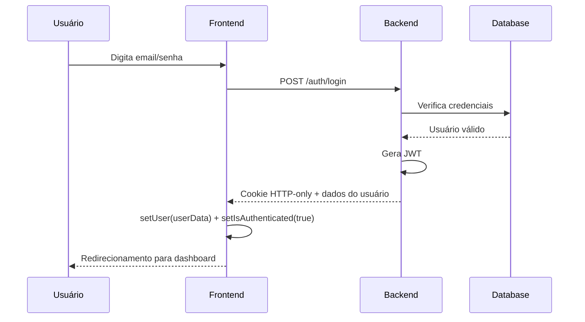

# 🔐 Fluxo de Autenticação - Vilma Plantas E-commerce

## 📋 Visão Geral

Este documento detalha como funciona o sistema de autenticação baseado em **cookies HTTP-only** com JWT, incluindo proteção de rotas e gerenciamento de estado do usuário.

## 🏗️ Arquitetura

```
┌─────────────────┐    ┌──────────────────┐    ┌─────────────────┐
│    Frontend     │    │     Backend      │    │    Database     │
│   (React TS)    │◄──►│   (Node/JWT)     │◄──►│    (Dados)      │
└─────────────────┘    └──────────────────┘    └─────────────────┘
         │                       │
         ▼                       ▼
  ┌─────────────┐         ┌─────────────┐
  │   Cookies   │         │   JWT       │
  │ (HTTP-Only) │         │ (Secure)    │
  └─────────────┘         └─────────────┘
```

## 🔄 Fluxo Completo de Autenticação

### 1. **Inicialização da Aplicação**

```typescript
// useAuth.ts - useEffect
useEffect(() => {
  checkAuth(); // Verifica se usuário já está logado
}, []);
```

**O que acontece:**

1. Aplicação carrega
2. `useAuth` executa `checkAuth()` automaticamente
3. Faz requisição `GET /auth/profile` com cookies existentes
4. **Se cookie válido**: Recupera dados do usuário
5. **Se cookie inválido**: Mantém estado deslogado

### 2. **Processo de Login**



**Código do Login:**

```typescript
// Login.tsx
async function handleLogin(e: React.FormEvent) {
  e.preventDefault();
  try {
    await login({ email, password });
    // Backend define cookie automaticamente
    // useAuth atualiza estado local
    navigate("/dashboard");
  } catch (error) {
    alert("Erro no login");
  }
}
```

**Backend Response:**

```json
{
  "user": {
    "id": 123,
    "name": "João Silva",
    "email": "joao@email.com",
    "role": "customer"
  },
  "message": "Login realizado com sucesso"
}

// + Cookie HTTP-only:
// Set-Cookie: jwt=eyJhbGc...; HttpOnly; Secure; SameSite=Strict
```

### 3. **Proteção de Rotas**

```typescript
// ProtectedRoute.tsx
function ProtectedRoute({ children }) {
  const { isAuthenticated, isInitialized } = useAuth();

  // 1. Aguarda verificação inicial
  if (!isInitialized) {
    return <Loading />;
  }

  // 2. Redireciona se não autenticado
  if (!isAuthenticated) {
    return <Navigate to="/login" />;
  }

  // 3. Libera acesso
  return children;
}
```

**Uso nas Rotas:**

```typescript
// Routes.tsx
<Routes>
  <Route path="/login" element={<Login />} />
  <Route path="/register" element={<Register />} />

  {/* Rotas Protegidas */}
  <Route
    path="/dashboard"
    element={
      <ProtectedRoute>
        <Dashboard />
      </ProtectedRoute>
    }
  />

  <Route
    path="/profile"
    element={
      <ProtectedRoute>
        <Profile />
      </ProtectedRoute>
    }
  />
</Routes>
```

### 4. **Requisições Autenticadas**

```typescript
// api.ts - Configuração global
export const api = axios.create({
  baseURL: "http://localhost:3000",
  withCredentials: true, // Inclui cookies em todas as requisições
});

// Uso em qualquer lugar
const produtos = await api.get("/produtos"); // Cookie vai automaticamente
const pedido = await api.post("/pedidos", dados); // Cookie vai automaticamente
```

### 5. **Verificação Contínua (checkAuth)**

```typescript
// useAuth.ts
async function checkAuth() {
  try {
    // Tenta acessar rota protegida
    const response = await authService.getProfile();

    // Sucesso = usuário logado
    setUser(response.data.user);
    setIsAuthenticated(true);
  } catch {
    // Erro = usuário não logado (cookie expirado/inválido)
    setUser(null);
    setIsAuthenticated(false);
  } finally {
    setIsInitialized(true); // Sempre marca como inicializado
  }
}
```

**Quando é executado:**

- ✅ Carregamento inicial da página
- ✅ Refresh da página (F5)
- ✅ Nova aba/janela
- ✅ Retorno de inatividade

### 6. **Logout**

```typescript
// useAuth.ts
async function logout() {
  try {
    await authService.logout(); // POST /auth/logout
    // Backend remove/expira o cookie
  } finally {
    // Limpa estado local sempre
    setUser(null);
    setIsAuthenticated(false);
  }
}
```

## 🔧 Estados do Sistema

### Estados do `useAuth`:

| Estado            | Tipo         | Descrição                     |
| ----------------- | ------------ | ----------------------------- |
| `loading`         | boolean      | Operação em andamento         |
| `user`            | object\|null | Dados do usuário logado       |
| `isAuthenticated` | boolean      | Status de autenticação        |
| `isInitialized`   | boolean      | Verificação inicial concluída |

### Fluxo de Estados:

```
Carregamento Inicial:
isInitialized = false
isAuthenticated = false
user = null

↓ checkAuth() executado ↓

Sucesso:
isInitialized = true
isAuthenticated = true
user = { id, name, email, ... }

Falha:
isInitialized = true
isAuthenticated = false
user = null
```

## 🛡️ Segurança

### Cookies HTTP-Only:

- ✅ **Inacessível via JavaScript** (proteção XSS)
- ✅ **Secure flag** (apenas HTTPS em produção)
- ✅ **SameSite** (proteção CSRF)
- ✅ **Expiração automática**

### Vantagens vs localStorage:

| Aspecto            | Cookies HTTP-Only | localStorage  |
| ------------------ | ----------------- | ------------- |
| XSS Protection     | ✅ Protegido      | ❌ Vulnerável |
| Auto-gerenciamento | ✅ Automático     | ❌ Manual     |
| Expiração          | ✅ Automática     | ❌ Manual     |
| HTTPS Only         | ✅ Configurável   | ❌ Não        |

## 📱 Uso Prático

### Em qualquer componente:

```typescript
function Dashboard() {
  const { user, isAuthenticated, logout } = useAuth();

  if (!isAuthenticated) {
    return <Navigate to="/login" />;
  }

  return (
    <div>
      <h1>Bem-vindo, {user?.name}!</h1>
      <button onClick={logout}>Sair</button>
    </div>
  );
}
```

### Para requisições específicas:

```typescript
function MyOrders() {
  const { user } = useAuth();
  const [orders, setOrders] = useState([]);

  useEffect(() => {
    if (user) {
      api
        .get(`/orders/user/${user.id}`)
        .then((response) => setOrders(response.data));
    }
  }, [user]);

  return <OrderList orders={orders} />;
}
```

## 🔄 Cenários Especiais

### 1. **Token Expirado**

```
Usuário faz requisição → Backend retorna 401 →
Frontend recebe erro → checkAuth() falha →
Usuário redirecionado para login
```

### 2. **Múltiplas Abas**

```
Login em aba A → Cookie definido →
Aba B automaticamente "loga" →
Logout em aba A → Cookie removido →
Aba B automaticamente "desloga"
```

### 3. **Refresh da Página**

```
F5 → useAuth executa checkAuth() →
Cookie existe → Recupera dados do usuário →
Estado restaurado sem perder login
```

## 🛠️ Arquivos Principais

### Frontend:

- **`/src/features/auth/hooks/useAuth.ts`** - Lógica principal de autenticação
- **`/src/features/auth/services/authService.ts`** - Requisições para backend
- **`/src/components/auth/ProtectedRoute.tsx`** - Proteção de rotas
- **`/src/lib/api.ts`** - Configuração do Axios

### Backend (requerido):

- **`POST /auth/login`** - Autenticação com cookie
- **`POST /auth/logout`** - Remove cookie
- **`GET /auth/profile`** - Verifica autenticação
- **`POST /user/`** - Registro de usuário

## 🚀 Benefícios da Implementação

1. **Segurança Máxima**: Cookies HTTP-only protegem contra XSS
2. **UX Transparente**: Login persiste entre sessões/abas
3. **Manutenção Simples**: Backend gerencia expiração automaticamente
4. **Escalabilidade**: Funciona em múltiplas abas/dispositivos
5. **Flexibilidade**: Backend pode alterar dados do usuário sem quebrar frontend

---

## 📞 Contato

Para dúvidas sobre este fluxo, consulte a documentação do backend ou entre em contato com a equipe de desenvolvimento.
